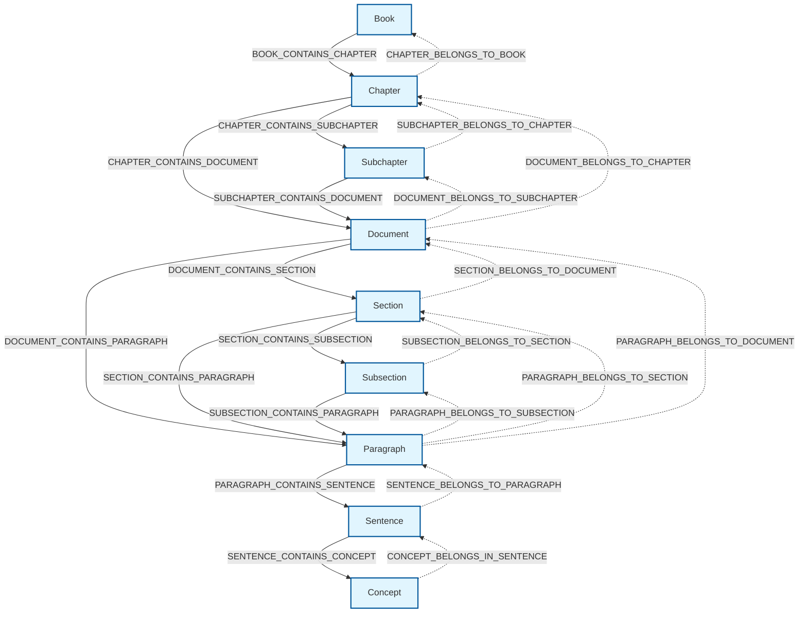

# Bee-Graph

A Neo4j-based knowledge graph system to query content in OpenStax textbooks using LLMs.

## Quick Setup

### 1. Prerequisites
- [Python 3.8+](https://www.python.org/) installed 
- [Docker Desktop](https://www.docker.com/) installed and running
- Git 

### 2. Setup Database
Docker provides a consistent and portable environment for running applications. Neo4j is a graph database optimized for connected data. Using Docker with Neo4j makes it easy to set up, run, and scale graph databases reliably across environments.


#### Clone the repository
```bash
git clone <your-repo-url>
cd bee-graph
```
#### Create virtual environment
```bash
python -m venv venv
```

#### Activate Python virtual environment
```bash
# Windows:
venv\Scripts\activate
# Mac/Linux:
source venv/bin/activate
```

#### Install requirements
```bash
pip install -r requirements.txt
```

#### Setup Neo4j database using Docker
```bash
python scripts/setup_database.py --auto-start-docker --create-database

#### Test database connection
python scripts/setup_database.py --test
```

#### Access Neo4j Browser
 Open in your browser: http://localhost:7474/


 ### 3. Load and Ingest OpenStax Textbooks 

 #### Copy the link to the OpexStax Github Repository 

 Navigate to https://github.com/openstax > Select your textbook > Click '<> Code' Green Button > Click 'HTTPS' > Copy link 

 #### Run the command below to load the textbook 

 ```bash 
cd textbooks
git submodule [link]
 ```

 #### Setup Database Nodes and Relationships

```bash
 python scripts/setup_neo4j_schema.py --setup-schema
 ```

#### Import Your Textbook and Extract Concepts

```bash 
python scripts/load_textbooks.py --textbook-path textbooks/osbooks-biology-bundle

#if you need to reimport and delete the database, please run (be careful): 
#python scripts/load_textbooks.py --textbook-path textbooks/osbooks-biology-bundle --cleanup
```

#### Run the LLM client to start querying the database 

```bash 
python streamlit run streamlit_app.py 
```

## Project Structure
```bash
bee-graph/
├── backup/              # Backup files
├── env/                 # Virtual environment
├── scripts/             # Setup and utility scripts
│   ├── load_textbooks.py
│   ├── setup_database.py
│   └── setup_neo4j_schema.py
├── src/                 # Source code
│   ├── chainlit_app/   # Chainlit application modules
│   │   ├── azure_config.py
│   │   ├── graph_retriever.py
│   │   └── rag_pipeline.py
│   ├── config/          # Configuration files
│   │   ├── azure_llm_lite.json
│   │   ├── config_loader.py
│   │   ├── neo4j_config.json
│   │   └── neo4j_config_template.json
│   ├── neo4j_utils/     # Neo4j utilities
│   │   ├── nodes.py
│   │   ├── relationships.py
│   │   └── schema.py
│   └── textbook_parse/  # Textbook parsing modules
│       ├── bulk_import.py
│       ├── xml_parser.py
│       └── concept_extraction/
│           ├── cache_manager.py
│           ├── concept_manager.py
│           ├── entity_extractor.py
│           ├── main.py
│           └── wikidata_client.py
├── tests/               # Test files
│   ├── check_db.py
│   ├── check_relationships.py
│   ├── check_reverse.py
│   ├── test_chainlit_setup.py
│   ├── test_hierarchy.py
│   └── test_rag_functionality.py
├── textbooks/           # OpenStax textbook content
├── wikidata_cache.json  # Wikidata cache file
├── llm_app.py          # LLM application
├── streamlit_app.py    # Streamlit application
└── requirements.txt     # Python dependencies
```

##Textbook Hierarchy 

